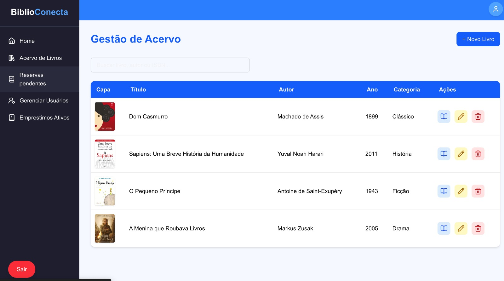
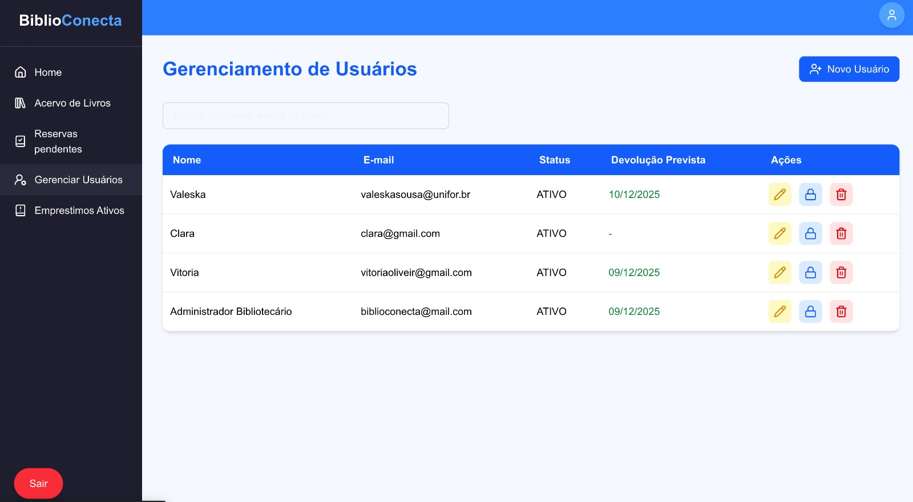

# 📚 BiblioConecta

Sistema web completo para **gerenciamento de bibliotecas**, permitindo o controle de livros, exemplares, usuários, empréstimos e reservas, com uma interface moderna e painel administrativo.

---

## 🎯 1. Objetivo do Projeto

O **BiblioConecta** foi desenvolvido com o propósito de modernizar e automatizar a gestão de bibliotecas, focando em:

* **Centralizar e organizar** o acervo de livros e exemplares.
* Automatizar os processos de **empréstimos** e **reservas**.
* Gerenciar usuários com diferentes perfis de **permissão**.
* Disponibilizar um **painel administrativo** com visão geral e controle do sistema.
* Facilitar o acesso dos leitores ao catálogo e ao seu histórico pessoal de atividades.

---

## ✨ 2. Funcionalidades Implementadas

A tabela abaixo lista as funcionalidades principais do sistema:

| Funcionalidade | Status |
| :--- | :--- |
| **Login / Autenticação (JWT)** | ✔ Completo |
| **CRUD de Livros** | ✔ Completo |
| **CRUD de Exemplares** | ✔ Completo |
| **Empréstimos** | ✔ Completo |
| **Reservas** | ✔ Completo |
| Filtro por categoria (Catálogo) | ✔ Implementado no Frontend |
| Perfil do usuário | ✔ Implementado |
| Histórico Mensal | ✔ Implementado |

---

## 💻 3. Telas do Sistema (Screenshots)

### 👤 Telas do Usuário / Leitor

<p align="center">
  
  
  
</p>

<p align="center">
  
  
</p>

### 🛠️ Telas do Administrador / Painel Gerencial

<p align="center">
  
  
  
</p>

<p align="center">
  
</p>

---

## 🏗️ 4. Visão Geral da Arquitetura

A arquitetura do **BiblioConecta** é modular e segue o padrão **Cliente-Servidor (RESTful)**, separando o frontend (visual) e o backend (lógica de negócio).

### **Backend (API)**
Aplicação monolítica desenvolvida em **Node.js** com **TypeScript** e **Express**.

* Concentra toda a **regra de negócio**, validações e controle de estado (empréstimos/reservas).
* Utiliza **Prisma ORM** para acesso ao banco de dados.
* Gerencia a **Autenticação** via tokens **JWT**.

### **Frontend (Cliente Web)**
SPA (Single Page Application) construída com **React** usando o framework **Next.js** (App Router) e **TypeScript**.

* Responsável pela **interface** do usuário e painel administrativo.
* Estilização moderna e responsiva com **Tailwind CSS**.
* Animações fluidas utilizando **Framer Motion**.

### **Comunicação**
A comunicação é feita **exclusivamente via API REST** utilizando **Axios** e rotas protegidas por *middleware* de autenticação JWT.

---

## 🛠️ 5. Tecnologias Utilizadas

| Categoria | Tecnologia |
| :--- | :--- |
| **Backend** | Node.js, Express, TypeScript |
| **Banco de Dados** | PostgreSQL (Neon DB) |
| **ORM** | Prisma ORM |
| **Autenticação** | JWT, Bcrypt |
| **Testes (Back)** | Vitest, Supertest |
| **Frontend** | Next.js 14, React, TypeScript |
| **Estilização** | Tailwind CSS, Lucide Icons |
| **Animações** | Framer Motion |
| **Infraestrutura** | Vercel (Front), Render (Back) |

---

## ⚙️ 6. Instruções de Instalação e Execução

Para rodar o projeto localmente, siga os passos abaixo. É necessário ter o **Node.js** e **npm** instalados.

### 1. Configuração do Backend

1.  Navegue até o diretório do backend e instale as dependências:
    ```bash
    cd backend
    npm install
    ```
2.  Crie um arquivo `.env` baseado no `.env.example` e configure a variável `DATABASE_URL` e `JWT_SECRET` (apontando para uma instância do PostgreSQL).
3.  Execute as migrations do banco de dados (o Prisma fará isso para você):
    ```bash
    npx prisma migrate dev
    ```
4.  Inicie o servidor em modo de desenvolvimento:
    ```bash
    npm run dev
    ```
    O servidor estará disponível em `http://localhost:3333`.

### 2. Configuração do Frontend

1.  Navegue até o diretório do frontend:
    ```bash
    cd frontend/web/biblioconecta
    npm install
    ```
2.  Inicie o cliente web:
    ```bash
    npm run dev
    ```
    O sistema estará acessível em **[http://localhost:3000](http://localhost:3000)**.

---

## 🔑 7. Credenciais de Teste

Utilize as seguintes credenciais para testar as diferentes permissões do sistema:

| Perfil | Email | Senha |
| :--- | :--- | :--- |
| **Administrador** | `biblioconecta@mail.com` | `admin12345678` |
| **Usuário Comum** | `usuario@biblioconecta.com` | `senha123` |

---

## 🔗 8. Links

| Tipo | Link |
| :--- | :--- |
| **Versão em Produção (Front)** | [Link para o Sistema (Vercel)](https://biblioconecta.vercel.app/) |
| **Vídeo Demonstrativo** | [Link para o Vídeo no YouTube](https://youtu.be/QYD7ZxB94Cg) |
| **Documentação da API (Swagger)** | [http://localhost:3333/api-docs/](http://localhost:3333/api-docs/) |

## ✅ 9. Validações e Evidências

O projeto passou por uma etapa de validação rigorosa que garantiu a aderência aos requisitos e a qualidade da entrega.

* **Validações de Regras de Negócio**: Foram verificadas as regras críticas, como o limite de empréstimos por usuário, a prioridade de reservas e a disponibilidade de exemplares.
* **Testes Unitários**: A maior parte da lógica de *backend* foi coberta por testes unitários, assegurando a consistência e a robustez da API.
* **Evidências**: A documentação inclui capturas de tela e um vídeo demonstrativo, que comprovam a implementação funcional de todas as funcionalidades listadas.

---


## 👨‍💻 10. Contribuições da Equipe

A seguir, detalhamos as responsabilidades e contribuições dos integrantes no desenvolvimento do projeto BiblioConecta:

| Integrante | Matrícula | Principais Contribuições |
| :--- | :--- | :--- |
| **ANTÔNIO MIKAEL VASCONCELOS AGUIAR** | 2326335 | Desenvolvimento e manutenção do **Backend** (API REST), incluindo a lógica de negócio, e implementação dos **Testes Unitários** (com Vitest/Supertest) para garantir a consistência das rotas. |
| **SANDY RODRIGUES DO NASCIMENTO** | 2326334 | Desenvolvimento do **Frontend** (Next.js/React), responsável pela interface do usuário, painel administrativo, consumo da API (Axios), gestão de estados e implementação do design (Tailwind CSS). |
| **VITÓRIA DE OLIVEIRA ALMEIDA** | 2325332 | Atuação em **Validações** de requisitos, organização e coleta de **Evidências** do sistema (capturas de tela, vídeos). |