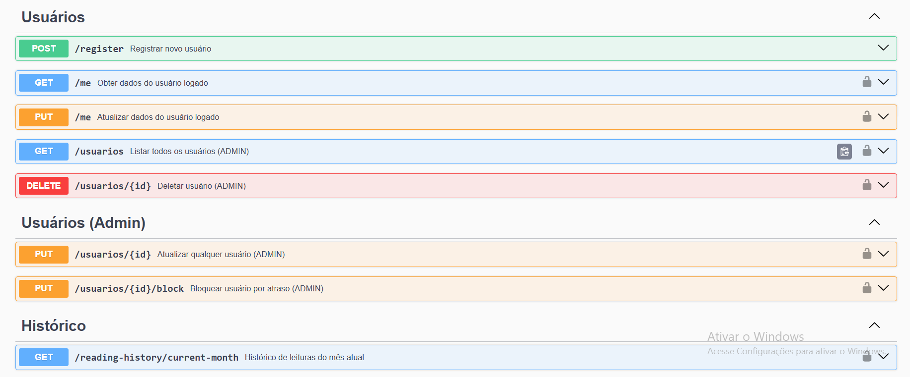
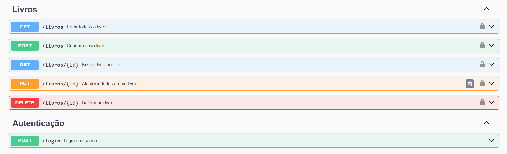
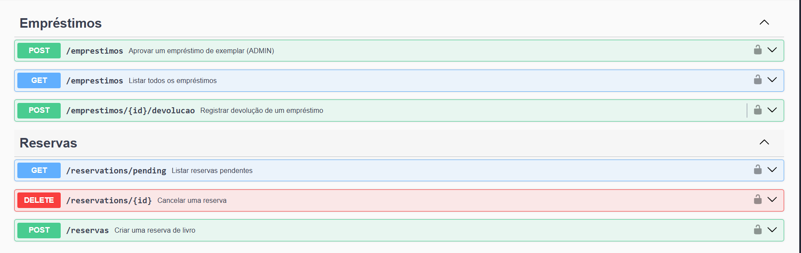

# 📘 Documentação da API — BiblioConecta

A API do BiblioConecta segue um padrão RESTful e disponibiliza funcionalidades para gerenciamento de usuários, livros, exemplares, reservas e empréstimos.

---

## 🚀 Executando o Backend

Para acessar o Swagger e testar os endpoints, é necessário iniciar o backend localmente.

### 🔧 Passo a passo para executar o servidor:

```bash
cd backend
npm install
npm run dev

---

<p align="center">  </p>

<p align="center">  </p>

<p align="center">  </p>